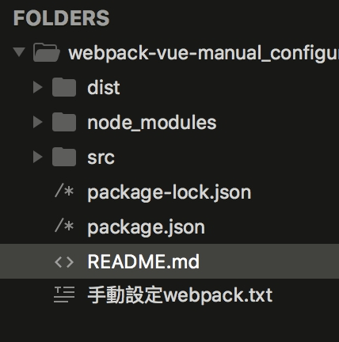
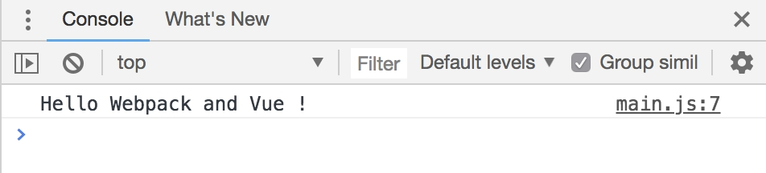
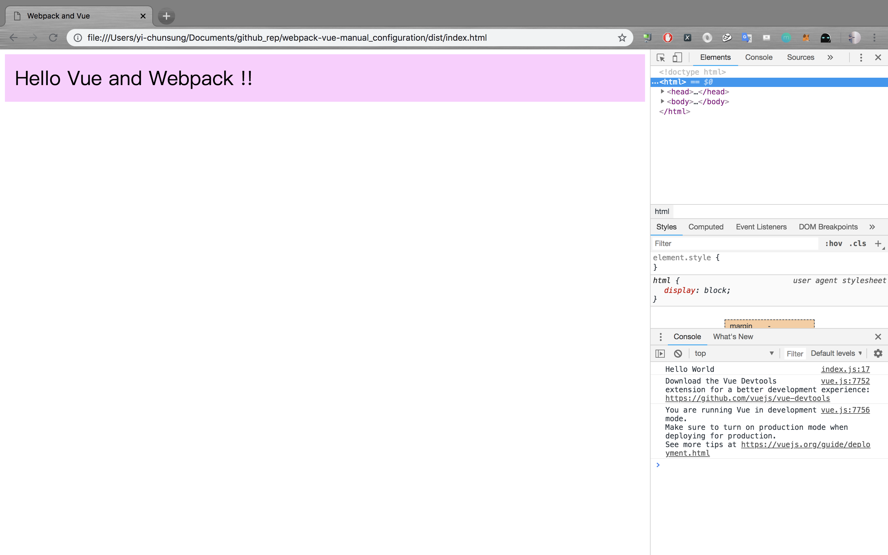

# 手動建置Webpack-Vue的開發環境

---

#### 作者： Yichun Sung
#### 日期： 2018-10-01

---

## Chapter 0. 前言

發想是來自於[彭彭老師](https://training.pada-x.com)在9/24的[Webpack 建置 React 開發環境教學直播](https://youtu.be/YN2hwa4_ins)。

因此，雖然有Vue-cli這種好用的工具，但是今天我們想要自虐地自己一步一步手動建置一個可以給Vue開發者開發的Webpack環境。

---

## Chapter 1. webpack 與 npm 基本安裝

1. 安裝 **node.js**
2. 建立專案資料夾
3. 初始化node.js 專案 
```bat
npm init -y
```
4. 使用 npm 安裝 **webpack**, **webpack-cli**:
```bat 
npm install webpack webpack-cli --save-dev 
```

5. 設置 package.json (專案描述檔) 用來執行 webpack，在`"scripts"`中加入build的規則。
		
```json
"scripts": {
	"test": "echo \"Error: no test specified\" && exit 1",
	"build": "webpack"
},		 
```
		

6. 基本專案資料夾結構與運作概念：

> /src/Vue原始碼  =={ webpack 轉換 }==> /dist/可執行檔

7. 所以根據上一點在專案目錄中新增 **src** 資料夾 與 **dist** 資料夾（Webpack的預設來源資料夾與目的資料夾）


8. 在**src**資料夾中建立一個**index.js** ，測試打包。使用指令： 
```bat
npm run build
```

9. 在 dist資料夾中建立一個 **index.html**，並且在當中引入**main.js**
```html
<!DOCTYPE html>
<html>
<head>
	<title> Webpack and Vue </title>
</head>
<body>
	<div id = "app"></div>
	<script src = "main.js"></script>
</body>
</html>

```
10. 打開 **index.html** 測試看看是否成功打開沒有錯誤

沒錯誤的話，就進入下一階段

---

## Chapter 2. 搭配Vue服用

1. 使用npm 安裝 **Vue**
```bat
npm install vue
```

2. 使用Vue 寫點東西測試，**在index.js上 import Vue**。

```javascript

import Vue from 'vue'

new Vue({
  el: '#app',
  mounted : function(){
  	console.log('Hello Webpack and Vue !');	 
  }
});

```

3. 重新使用指令打包 ： 
```bat
npm run build
```

4. 打開**index.html** 測試，開啟開發者介面，查看剛剛寫的有無印出來。



有印出來的話，就成功完成了Vue 和 Webpack的基本配置了。

---

## Chapter 3. 設置.vue打包和Vue-components

1. 安裝 Babel相關套件用來編譯複雜的js框架中複雜的語法： 

安裝 **babel-core** 和 **babel-loader** 
```bat
npm install babel-core babel-loader --save-dev
```

2. 安裝 **babel-preset-env** 和 **babel-preset-vue**
```bat
npm install babel-preset-env babel-preset-vue --save-dev
```

3. 安裝 Vue-loader相關套件，用來協助編譯.vue中的語法和vue template

安裝**vue-loader**, **vue-style-loader**, **css-loader**, **file-loader**, **vue-template-compiler**
```bat
npm install vue-loader vue-style-loader css-loader file-loader vue-template-compiler --save-dev
```

4. 在`package.json`中把設定處理好，加入以下設定：

```json
"babel":{
      		"presets": ["env", "vue"]
    	},
```

5. 建議將**babel-loader** 降版至 **7.1.5**，比較不會有問題

```json
"babel-loader": "^7.1.5",
```

6. 在專案資料夾目錄下建立一個 webpack 基本設定檔 `webpack.config.js`

依據[webpack官網](https://webpack.js.org)文件設定：[設定指南](https://webpack.js.org/guides/getting-started/#using-a-configuration)

```javascript
const path = require('path');

module.exports = {
  entry: './src/index.js',
  output: {
    filename: 'main.js',
    path: path.resolve(__dirname, 'dist')
  }
};

```

7. 在webpack設定檔中：加入**babel-loader** 設定。

8. 在webpack設定檔中加入 **vue-loader**設定，以及**VueLoaderPlugin**設定，以支援**.vue**檔。

9. 在webpack設定檔中加入 **file-loader**設定，用以打包圖片檔等檔案。

綜合第7點,第8點和第9點，完整的設定如下：


```javascript
// webpack.config.js
const path = require('path')
const VueLoaderPlugin = require('vue-loader/lib/plugin')

module.exports = {
  entry: './src/index.js',
  output: {
    filename: 'main.js',
    path: path.resolve(__dirname, 'dist')
  },
  mode: 'development',
  module: {
    rules: [
      {
        test: /\.vue$/,
        loader: 'vue-loader'
      },
      // this will apply to both plain `.js` files
      // AND `<script>` blocks in `.vue` files
      {
        test: /\.js$/,
        loader: 'babel-loader'
      },
      // this will apply to both plain `.css` files
      // AND `<style>` blocks in `.vue` files
      {
        test: /\.css$/,
        use: [
          'vue-style-loader',
          'css-loader'
        ]
      },
      {
        test: /\.(png|jpg|gif|svg)$/,
        loader: 'file-loader',
        options: {
          name: '[name].[ext]?[hash]'
        }
      }
    ]
  },
  plugins: [
    // make sure to include the plugin for the magic
    new VueLoaderPlugin()
  ]
}
```
>如果你現在就建立一個vue的元件，然後掛載並且執行 `npm run build`後，會發現打包成功但是打開**index.html**卻沒有畫面，這是因為我們還沒設置模板編譯。

10. 在webpack 基本設定檔中設置模板的編譯，加入以下

```javascript
resolve: { 
    		alias: { 
      			'vue': 'vue/dist/vue.js' 
    		} 
  		}
```

完整的 `webpack.config.js` 如下：

```javascript
// webpack.config.js
const path = require('path')
const VueLoaderPlugin = require('vue-loader/lib/plugin')

module.exports = {
  entry: './src/index.js',
  output: {
    filename: 'main.js',
    path: path.resolve(__dirname, 'dist')
  },
  mode: 'development',
  module: {
    rules: [
      {
        test: /\.vue$/,
        loader: 'vue-loader'
      },
      // this will apply to both plain `.js` files
      // AND `<script>` blocks in `.vue` files
      {
        test: /\.js$/,
        loader: 'babel-loader'
      },
      // this will apply to both plain `.css` files
      // AND `<style>` blocks in `.vue` files
      {
        test: /\.css$/,
        use: [
          'vue-style-loader',
          'css-loader'
        ]
      },
      {
        test: /\.(png|jpg|gif|svg)$/,
        loader: 'file-loader',
        options: {
          name: '[name].[ext]?[hash]'
        }
      }
    ]
  },
  plugins: [
    // make sure to include the plugin for the magic
    new VueLoaderPlugin()
  ],
  resolve: { 
    alias: { 
      'vue': 'vue/dist/vue.js' 
    } 
  }
}
```

11. 接著在src中建立一個hello.vue檔測試

```vue
<template>
  <div class="hello">Hello {{ who }}</div>
</template>

<script>
module.exports = {
  data: function() {
    return {
      who: 'Vue and Webpack !!'
    }
  }
};
</script>

<style scoped>
.hello {
  padding: .5em;
  font-size: 2em;
  background-color: #fcf;
}
</style>
```

index.js 也掛載這個hello.vue

```javascript
import Vue from 'vue'
import hello from './hello.vue'

new Vue({
  el: '#app',
  mounted : function(){
  	console.log('Hello World');
  	 
  },
  components: { hello },
  template: '<hello/>'
})


```

12. 打包 並且打開 **index.html**測試。
```bat
npm run build
```

13. 成功




---

## Reference

https://youtu.be/YN2hwa4_ins

https://vue-loader.vuejs.org/guide/#manual-configuration

https://juejin.im/post/5acd890d6fb9a028d043ca15

https://segmentfault.com/a/1190000005363030

https://webpack.js.org/guides/getting-started/#using-a-configuration

https://www.imooc.com/article/17868


